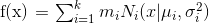
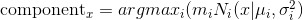
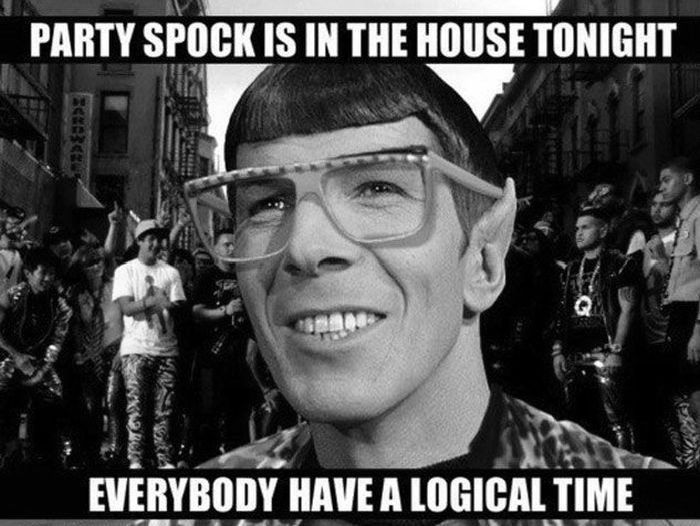
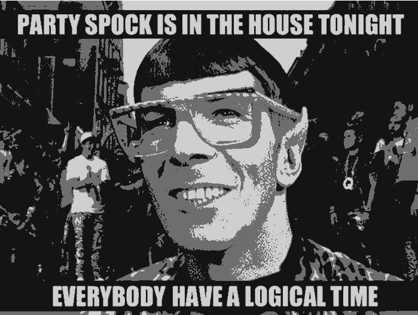
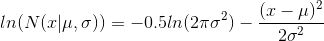

# Assignment 5 - Expectation Maximization

## Overview

Automatic image processing is a key component to many AI systems, including facial recognition and video compression. One basic method for processing is segmentation, by which we divide an image into a fixed number of components in order to simplify its representation. For example, we can train a mixture of Gaussians to represent an image, and segment it according to the simplified representation as shown in the images below.

In this assignment, you will learn to perform image segmentation. To this end, you will implement Gaussian mixture models and iteratively improve their performance. You will perform this segmentation on the "Bird" and "Party Spock" images included with the assignment.

Your assignment is to implement several methods of image segmentation, with increasing complexity:

1) Implement k-means clustering to segment a color image.
2) Build a Gaussian mixture model to be trained with expectation-maximization.
3) Experiment with varying the details of the Gaussian mixture model’s implementation.
4) Implement and test a new metric called the Bayesian information criterion, which guarantees a more robust image segmentation.

## Grading

The grade you receive for the assignment will be distributed as follows:
1) k-Means Clustering (19 points)
2) Gaussian Mixture Model (40 points)
3) Model Performance Improvements (20 points)
4) Bayesian Information Criterion (20 points)
5) Return your name (1 point)
6) Bonus (+2 points)

## Due Date
The assignment is due November 12th, 2017 at 11:59PM UTC-12 (Anywhere on Earth time). The deliverable for this assignment is a completed mixture_models.py file.

## Resources

The em.pdf chapter in the assignment folder gives a good explanation of implementing and training mixture models, particularly 424-427 (k-means) and 435-439 (mixture models and EM). The book Elements of Statistical Learning, pages 291-295.

## Background

A Gaussian mixture model is a generative model for representing the underlying probability distribution of a complex collection of data, such as the collection of pixels in a grayscale photograph.
In the context of this problem, a Gaussian mixture model defines the joint probability  f(x)  as

 
where x is a grayscale value [0,1],  f(x)  is the joint probability of that gray scale value,  m sub i is the mixing coefficient on component i,  N sub i is the  i-th  Gaussian distribution underlying the value  x  with mean  mu sub i and variance  sigma sub i squared.

We will be using this model to segment photographs into different grayscale regions. The idea of segmentation is to assign a component  i  to each pixel  x using the maximum posterior probability

 
Then we will replace each pixel in the image with its corresponding  $μ_i$  to produce a result as below (original above, segmented with three components below).

## Part 0: Note on Vectorization

The concept of Vectorization was introduced in the last section of Assignment 4. For this assignment, please vectorize your code wherever possible using numpy arrays, instead of running for-loops over the images being processed.
For an example of how this might be useful, consider the following array:
A = [12 34 1234 764 ...(has a million values)... 91, 78]
Now you need to calculate another array B, which has the same dimensions as A above. Say each value in B is calculated as follows:
(each value in B) = square_root_of(some constants pi log(k) * (each value in A))/7
You might wish to use a for-loop to compute this. However, it will take really long to run on an array of this magnitude.
Alternatively, you may choose to use numpy and perform this calculation in a single line. You can pass A as a numpy array and the entire calculation will be done in a line, resulting in B being populated with the corresponding values that come out of this formula.

## Part 1: K-means Clustering

19 pts
One easy method for image segmentation is to simply cluster all similar data points together and then replace their values with the mean value. Thus, we'll warm up using k-means clustering. This will also provide a baseline to compare with your segmentation. Please note that clustering will come in handy later.
Fill out k_means_cluster() to convert the original image values matrix to its clustered counterpart. Your convergence test should be whether the assigned clusters stop changing. Note that this convergence test is rather slow. When no initial cluster means are provided, k_means_cluster() should choose  k random points from the data (without replacement) to use as initial cluster means.
For this part of the assignment, since clustering is best used on multidimensional data, we will be using the color image bird_color_24.png.
You can test your implementation of k-means using our reference images in k_means_test().
Try to vectorize the code for it to run faster. Without vectorization it takes 25-30 minutes for the code to run.

## Part 2: Implementing a Gaussian Mixture Model

40 pts
Next, we will step beyond clustering and implement a complete Gaussian mixture model.
Complete the implementation of GaussianMixtureModel so that it can perform the following:

1) Calculate the joint log probability of a given greyscale value. (5 points)
2) Use expectation-maximization (EM) to train the model to represent the image as a mixture of Gaussians. (20 points) To initialize EM, set each component's mean to the grayscale value of randomly chosen pixel and variance to 1, and the mixing coefficients to a uniform distribution. Note: there are packages that can run EM automagically, but please implement your own version of EM without using these extra packages. We've set the convergence condition for you in GaussianMixtureModel.default_convergence(): if the new likelihood is within 10% of the previous likelihood for 10 consecutive iterations, the model has converged.
3) Calculate the log likelihood of the trained model. (5 points)
4) Segment the image according to the trained model. (5 points)
5) Determine the best segmentation by iterating over model training and scoring, since EM isn't guaranteed to converge to the global maximum. (5 points)

When multiplying lots of probabilities in sequence, you can end up with a probability of zero due to underflow. To avoid this, you should calculate the log probabilities for the entire assignment.
The log form of the Gaussian probability of scalar value  x  is:

where mu is the mean and sigma is the standard deviation.

You can calculate the sum of log probabilities using scipy.misc.logsumexp(). For example, logsumexp([-2, -3]) will return the same result as numpy.log(numpy.exp(-2) + numpy.exp(-3))

Rather than using lists of lists, you're probably going to have an easier time using numpy arrays.

Warning: You may lose all marks for this part if your code runs for too long.

You will need to vectorize your code in this part. Specifically, the method train_model() needs to perform operations using numpy arrays, as does likelihood(), which calculates the log likelihood. These are time-sensitive operations and will be called over and over as you proceed with this assignment.

For the synthetic data test which we provide to check if your training is working, the set is too small and it won't make a difference. But with the actual image that we use ahead, for-loops won't do good. Vectorized code would take under 30 seconds to converge which would typically involve about 15-20 iterations with the convergence function we have here. Inefficient code that uses loops or iterates over each pixel value sequentially, will take hours to run. You don't want to do that because:

## Part 3: Model Experimentation

20 points

We'll now experiment with a few methods for improving GMM performance.

## Part 3a: Improved Initialization

12.5 points

To run EM in our baseline Gaussian mixture model, we use random initialization to determine the initial values for our component means. We can do better than this!
Fill in GaussianMixtureModelImproved.initialize_training() with an improvement in component initialization. Please don't use any external packages for anything other than basic calculations (e.g. scipy.misc.logsumexp). Note that your improvement might significantly slow down runtime, although we don't expect you to spend more than 10 minutes on initialization.

Hint: you'll probably want an unsupervised learning method to initialize your component means. Clustering is one useful example of unsupervised learning, and you may want to look at 1-dimensional methods such as Jenks natural breaks optimization.

## Part 3b: Convergence Condition

7.5 points

You might be skeptical of the convergence criterion we've provided in default_convergence(). To test out another convergence condition, implement new_convergence_condition() to return true if all the new model parameters (means, variances, and mixing coefficients) are within 10% of the previous variables for 10 consecutive iterations. This will mean re-implementing train_model(), which you will also do in GaussianMixtureModelConvergence.

You can compare the two convergence functions in convergence_condition_test().

## Part 4: Bayesian Information Criterion

20 points

In our previous solutions, our only criterion for choosing a model was whether it maximizes the posterior likelihood regardless of how many parameters this requires. As a result, the "best" model may simply be the model with the most parameters, which would be overfit to the training data.

To avoid overfitting, we can use the Bayesian information criterion (a.k.a. BIC) which penalizes models based on the number of parameters they use. In the case of the Gaussian mixture model, this is equal to the number of components times the number of variables per component (mean, variance and mixing coefficient) = 3 x components.

## Part 4a: Implement BIC

5 points

Implement bayes_info_criterion() to calculate the BIC of a trained GaussianMixtureModel.

## Part 4b: Test BIC

15 points

Now implement BIC_model_test(), in which you will use the BIC and likelihood to determine the optimal number of components in the Party Spock image. Use the original GaussianMixtureModel for your models. Iterate from k=2 to k=7 and use the provided means to train a model that minimizes its BIC and a model that maximizes its likelihood.
Then, fill out BIC_likelihood_question() to return the number of components in both the min-BIC and the max-likelihood model.

## Part 5: Return your name

1 point

A simple task to wind down the assignment. Return your name from the function aptly called return_your_name().

## Part 6: Bonus

+2 points

A crucial part of machine learning is working with very large datasets. As stated before, using for loops over these datasets will result in the code taking many hours, or even several days, to run. Even vectorization can take time if not done properly, and as such there are certain tricks you can perform to get your code to run as fast as physically possible.

For this part of the assignment, you will need to implement part of a k-Means algorithm. You are given two arrays - points_array with X n-dimensional points, and means_array with Y n-dimensional points. You will need to return an X x Y array containing the distances from each point in points_array to each point in means_array.

